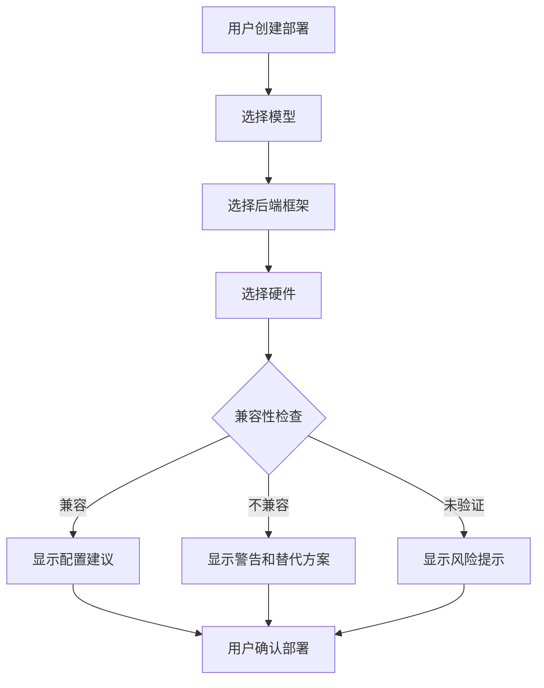
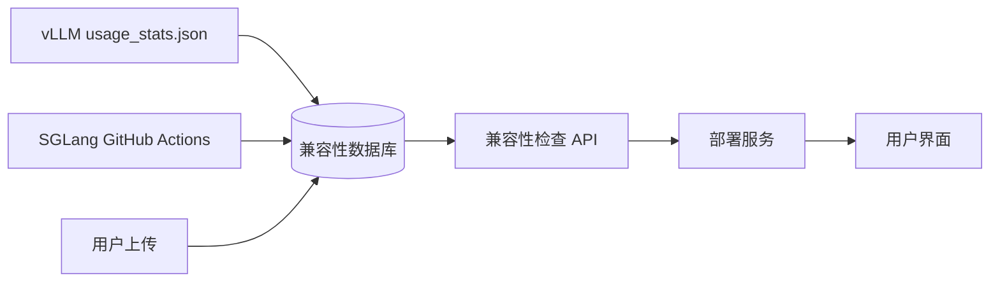

# 兼容性组件设计文档

## 目录
- [1. 功能说明](#1-功能说明)
- [2. 数据来源](#2-数据来源)
- [3. 数据结构设计](#3-数据结构设计)
- [4. 添加新数据](#4-添加新数据)
- [5. 展示方式](#5-展示方式)
- [6. 后端对接方式](#6-后端对接方式)
- [7. 技术实现](#7-技术实现)
- [8. 安全与隐私](#8-安全与隐私)

---

## 1. 功能说明

### 1.1 组件概述

兼容性组件是 TokenMachine 平台的核心功能模块，用于管理和展示 LLM 推理框架（vLLM、SGLang、llama.cpp）与不同硬件平台、模型架构之间的兼容性信息。

### 1.2 核心功能

#### 1.2.1 兼容性矩阵查询
- **框架支持**: 查询不同推理框架支持的功能特性
- **硬件兼容**: 检查特定 GPU/NPU/CPU 型号是否支持
- **模型兼容**: 验证模型架构与框架的兼容性
- **性能指标**: 提供历史性能数据（TPS、TTFT、吞吐量）

#### 1.2.2 兼容性检查
- **部署前验证**: 在创建部署时自动检查兼容性
- **配置建议**: 根据硬件和模型推荐最优配置
- **风险预警**: 标记未验证或已知问题的组合

#### 1.2.3 数据贡献
- **自动收集**: vLLM usage_stats 自动上报（可禁用）
- **CI 集成**: 从 SGLang GitHub Actions 提取测试结果
- **用户上传**: 手动提交兼容性报告

### 1.3 使用场景



---

## 2. 数据来源

### 2.1 数据源概览

| 数据源 | 类型 | 覆盖范围 | 可靠性 | 更新频率 |
|--------|------|----------|--------|----------|
| vLLM usage_stats | 自动收集 | 全球实际部署 | 高 | 实时 |
| SGLang CI/CD | 自动提取 | 测试覆盖的硬件/模型 | 极高 | 每日 |
| 用户上传 | 社区贡献 | 长尾场景 | 中 | 持续 |
| 官方文档 | 手动整理 | 厂商声明 | 高 | 按版本 |

### 2.2 vLLM usage_stats

#### 2.2.1 数据收集机制

vLLM 在每次启动时自动收集匿名使用数据，存储在 `~/.config/vllm/usage_stats.json`。

**收集的数据结构**:
```json
{
  "system_info": {
    "uuid": "anonymous-identifier",
    "provider": "cloud-provider",
    "cpu_info": "Intel Xeon...",
    "memory_info": "256GB",
    "architecture": "x86_64",
    "platform": "linux"
  },
  "gpu_info": {
    "gpu_count": 8,
    "gpu_type": "NVIDIA H100",
    "gpu_memory_per_device": 80,
    "compute_capability": "9.0"
  },
  "model_info": {
    "model_architecture": "llama",
    "model_name": "meta-llama/Llama-2-70b-hf",
    "dtype": "float16",
    "quantization": "awq"
  },
  "config": {
    "tensor_parallel_size": 8,
    "gpu_memory_utilization": 0.9,
    "max_model_len": 4096,
    "block_size": 16,
    "enable_prefix_caching": true,
    "enforce_eager": false
  },
  "usage_context": {
    "LLM_CLASS": "vllm.model_executor.ModelExecutor",
    "production": true
  }
}
```

**收集触发点**:
```python
# vLLM 源码中的收集点
# vllm/config.py:740
if not VLLM_NO_USAGE_STATS:
    collect_usage_stats(model_config, parallel_config, scheduler_config)
```

**禁用方法**:
```bash
export VLLM_NO_USAGE_STATS=1
```

#### 2.2.2 数据提取脚本

```python
# backend/workers/compatibility/vllm_stats_collector.py
import json
import os
from pathlib import Path
from datetime import datetime
from typing import Optional

def collect_vllm_stats(
    user_id: Optional[str] = None,
    deployment_id: Optional[str] = None
) -> dict:
    """
    从 vLLM usage_stats.json 收集兼容性数据

    Args:
        user_id: 用户ID（用于去重，不存储）
        deployment_id: 部署ID（用于关联）

    Returns:
        兼容性记录字典
    """
    stats_path = Path.home() / ".config" / "vllm" / "usage_stats.json"

    if not stats_path.exists():
        return {}

    with open(stats_path) as f:
        stats = json.load(f)

    # 匿名化处理
    anonymized = {
        "metadata": {
            "source": "vllm_usage_stats",
            "collected_at": datetime.utcnow().isoformat(),
            "confidence": "high",
            "verified": True
        },
        "backend": {
            "name": "vllm",
            "version": stats.get("vllm_version", "unknown")
        },
        "hardware": {
            "vendor": _extract_gpu_vendor(stats["gpu_info"]["gpu_type"]),
            "model": stats["gpu_info"]["gpu_type"],
            "count": stats["gpu_info"]["gpu_count"],
            "memory_per_device": stats["gpu_info"].get("gpu_memory_per_device"),
            "architecture": stats["system_info"].get("architecture")
        },
        "model": {
            "architecture": stats["model_info"]["model_architecture"],
            "dtype": stats["model_info"]["dtype"],
            "quantization": stats["model_info"].get("quantization")
        },
        "config": {
            "tensor_parallel_size": stats["config"]["tensor_parallel_size"],
            "gpu_memory_utilization": stats["config"]["gpu_memory_utilization"],
            "max_model_len": stats["config"]["max_model_len"]
        },
        "features": {
            "prefix_caching": stats["config"].get("enable_prefix_caching", False),
            "enforce_eager": stats["config"].get("enforce_eager", false)
        }
    }

    return anonymized
```

### 2.3 SGLang CI/CD

#### 2.3.1 GitHub Actions 工作流分析

SGLang 通过 GitHub Actions 进行大规模兼容性测试，覆盖多种硬件平台。

**硬件覆盖矩阵**:

| 平台 | 型号 | 显存 | 架构 | Runner Labels |
|------|------|------|------|---------------|
| NVIDIA | RTX 5090 | 32GB | Blackwell (SM120) | `1-gpu-5090` |
| NVIDIA | H100 | 80GB | Hopper | `1-gpu-runner`, `4-gpu-h100` |
| NVIDIA | H200 | 141GB | Hopper | `8-gpu-h200` |
| NVIDIA | H20 | 96GB | Hopper | `8-gpu-h20` (RDMA) |
| NVIDIA | B200 | 144GB | Blackwell | `4-gpu-b200`, `8-gpu-b200` |
| NVIDIA | GB200 | - | Blackwell | `8-gpu-gb200` |
| AMD | MI325 | 128GB | CDNA 3 | `linux-mi325-gpu-*` |
| AMD | MI35X | - | CDNA | `linux-mi35x-gpu-*` |
| 华为 | Ascend A2 | 64GB | CANN 8.3 | `linux-aarch64-a2-*` |
| 华为 | Ascend A3 | - | CANN | `linux-aarch64-a3-16` |

**测试架构**:

```
Stage A: 基础测试 (< 5 分钟)
├── CUDA/ROCm 功能测试
├── CPU-only 测试
└── 基本兼容性验证

Stage B: 模型测试 (分区并行)
├── 小模型 (5090, 8 partitions)
├── 大模型 (H100, 12 partitions)
├── 2-GPU 张量并行
├── 性能测试 (TPS, TTFT)
├── 准确性测试 (Human Eval)
└── 多模态测试

Stage C: 大规模测试 (4/8 GPU)
├── 4-GPU 并行
├── 8-GPU 并行
├── RDMA 网络测试
└── 分布式推理
```

#### 2.3.2 数据提取方法

```python
# backend/workers/compatibility/sglang_ci_extractor.py
import requests
from typing import List, Dict
from datetime import datetime, timedelta

GITHUB_API_BASE = "https://api.github.com/repos/sgl-project/sglang"

def extract_sglang_ci_data(
    days: int = 30,
    workflows: List[str] = None
) -> List[dict]:
    """
    从 SGLang GitHub Actions 提取兼容性数据

    Args:
        days: 提取最近N天的数据
        workflows: 工作流列表 ['pr-test', 'pr-test-amd', 'pr-test-npu']

    Returns:
        兼容性记录列表
    """
    if workflows is None:
        workflows = ['pr-test', 'pr-test-amd', 'pr-test-npu']

    records = []
    since = datetime.utcnow() - timedelta(days=days)

    for workflow in workflows:
        # 获取工作流运行记录
        url = f"{GITHUB_API_BASE}/actions/workflows/{workflow}.yml/runs"
        params = {
            "status": "success",
            "per_page": 100,
            "created": f">={since.isoformat()}"
        }

        response = requests.get(url, params=params)
        runs = response.json().get("workflow_runs", [])

        for run in runs:
            # 提取硬件信息
            hardware = _parse_hardware_from_runner(run)

            # 提取测试信息
            test_info = _parse_test_from_logs(run)

            records.append({
                "metadata": {
                    "source": "sglang_ci",
                    "run_id": run["id"],
                    "run_date": run["created_at"],
                    "commit_sha": run["head_sha"],
                    "workflow": workflow
                },
                "hardware": hardware,
                "test": test_info,
                "result": {
                    "status": "success" if run["conclusion"] == "success" else "failure",
                    "duration_seconds": (run["updated_at"] - run["created_at"]).seconds
                }
            })

    return records

def _parse_hardware_from_runner(run: dict) -> dict:
    """从 runner 标签解析硬件信息"""
    labels = run.get("runner_group_name", "")

    # 映射表
    hardware_map = {
        "1-gpu-5090": {"vendor": "NVIDIA", "model": "RTX-5090", "count": 1, "memory": 32},
        "4-gpu-h100": {"vendor": "NVIDIA", "model": "H100", "count": 4, "memory": 80},
        "8-gpu-h200": {"vendor": "NVIDIA", "model": "H200", "count": 8, "memory": 141},
        "linux-mi325-gpu-1": {"vendor": "AMD", "model": "MI325", "count": 1, "memory": 128},
        "linux-aarch64-a2-1": {"vendor": "Huawei", "model": "Ascend-A2", "count": 1, "memory": 64},
        # ... 更多映射
    }

    return hardware_map.get(labels, {
        "vendor": "Unknown",
        "model": labels,
        "count": 1
    })

def _parse_test_from_logs(run: dict) -> dict:
    """从日志解析测试信息"""
    logs_url = f"{run['logs_url']}"

    # 下载并解析日志
    # 提取 run_suite.py 参数
    # 解析性能数据

    return {
        "suite": "stage-b-test-small-1-gpu",
        "hw": "cuda",
        "models": ["llama-2-7b", "qwen-7b"],
        "partition_id": 0,
        "total_partitions": 8
    }
```

#### 2.3.3 CI 数据映射表

| Runner Label | Vendor | Model | Count | Memory | Architecture |
|--------------|--------|-------|-------|--------|--------------|
| `1-gpu-5090` | NVIDIA | RTX 5090 | 1 | 32GB | Blackwell |
| `4-gpu-h100` | NVIDIA | H100 | 4 | 80GB | Hopper |
| `8-gpu-h200` | NVIDIA | H200 | 8 | 141GB | Hopper |
| `4-gpu-b200` | NVIDIA | B200 | 4 | 144GB | Blackwell |
| `linux-mi325-gpu-2` | AMD | MI325 | 2 | 128GB | CDNA 3 |
| `linux-mi35x-gpu-8` | AMD | MI35X | 8 | - | CDNA |
| `linux-aarch64-a2-4` | Huawei | Ascend A2 | 4 | 64GB | CANN |
| `linux-aarch64-a3-16` | Huawei | Ascend A3 | 16 | - | CANN |

### 2.4 用户上传

#### 2.4.1 上传表单设计

```typescript
// 兼容性报告上传表单
interface CompatibilityReportForm {
  // 后端信息
  backend: {
    name: 'vllm' | 'sglang' | 'llamacpp';
    version: string;
  };

  // 硬件信息
  hardware: {
    vendor: string;
    model: string;
    count: number;
    memoryPerDevice?: number;
    features?: string[]; // ['tensorcore', 'rdma', 'xformers']
  };

  // 模型信息
  model: {
    name: string;
    architecture: string;
    dtype: string;
    quantization?: string;
    parameters: string; // '7B', '70B'
  };

  // 配置信息
  config: {
    tensorParallelSize: number;
    pipelineParallelSize?: number;
    gpuMemoryUtilization: number;
    maxModelLen: number;
  };

  // 测试结果
  test_results: {
    status: 'success' | 'partial' | 'failure';
    tps?: number;
    ttft_ms?: number;
    memory_usage_gb?: number;
    error_message?: string;
  };

  // 附加信息
  notes?: string;
  environment?: string; // OS, driver versions
}
```

#### 2.4.2 数据验证

```python
# backend/api/v1/compatibility.py
from fastapi import APIRouter, Depends, HTTPException
from pydantic import BaseModel, validator

class CompatibilityReport(BaseModel):
    backend: str
    hardware: dict
    model: dict
    config: dict
    test_results: dict

    @validator('backend')
    def validate_backend(cls, v):
        allowed = ['vllm', 'sglang', 'llamacpp']
        if v not in allowed:
            raise ValueError(f'Backend must be one of {allowed}')
        return v

    @validator('hardware')
    def validate_hardware(cls, v):
        required = ['vendor', 'model', 'count']
        if not all(k in v for k in required):
            raise ValueError(f'Hardware must contain {required}')
        if v['count'] < 1:
            raise ValueError('GPU count must be >= 1')
        return v

    @validator('config')
    def validate_config(cls, v):
        if v.get('tensor_parallel_size', 1) > v.get('hardware', {}).get('count', 1):
            raise ValueError('TP size cannot exceed GPU count')
        if not 0 < v.get('gpu_memory_utilization', 0.9) <= 1.0:
            raise ValueError('GPU memory utilization must be in (0, 1]')
        return v
```

---

## 3. 数据结构设计

### 3.1 数据库表结构

```sql
-- 兼容性记录表
CREATE TABLE compatibility_records (
    id SERIAL PRIMARY KEY,
    created_at TIMESTAMP DEFAULT NOW(),

    -- 元数据
    source VARCHAR(50) NOT NULL, -- 'vllm_usage_stats', 'sglang_ci', 'user_upload'
    confidence VARCHAR(20) NOT NULL, -- 'high', 'medium', 'low'
    verified BOOLEAN DEFAULT FALSE,

    -- 后端信息
    backend_name VARCHAR(20) NOT NULL,
    backend_version VARCHAR(50),

    -- 硬件信息
    hardware_vendor VARCHAR(50),
    hardware_model VARCHAR(100),
    hardware_count INTEGER,
    hardware_memory_per_device INTEGER, -- GB
    hardware_architecture VARCHAR(50),
    hardware_features JSONB, -- ['tensorcore', 'rdma']

    -- 模型信息
    model_architecture VARCHAR(50),
    model_dtype VARCHAR(20),
    model_quantization VARCHAR(20),

    -- 配置信息
    config_tensor_parallel_size INTEGER,
    config_gpu_memory_utilization FLOAT,
    config_max_model_len INTEGER,
    config_features JSONB,

    -- 兼容性结果
    compatibility_status VARCHAR(20), -- 'compatible', 'partial', 'incompatible'
    compatibility_openai_api BOOLEAN,
    compatibility_batch_inference BOOLEAN,

    -- 性能指标
    performance_tps FLOAT,
    performance_ttft_ms FLOAT,
    performance_memory_usage_gb FLOAT,

    -- 错误信息
    error_type VARCHAR(100),
    error_message TEXT,

    -- 索引
    CONSTRAINT valid_source CHECK (source IN ('vllm_usage_stats', 'sglang_ci', 'user_upload', 'manual')),
    CONSTRAINT valid_confidence CHECK (confidence IN ('high', 'medium', 'low')),
    CONSTRAINT valid_status CHECK (compatibility_status IN ('compatible', 'partial', 'incompatible'))
);

-- 索引
CREATE INDEX idx_compat_backend ON compatibility_records(backend_name);
CREATE INDEX idx_compat_hardware ON compatibility_records(hardware_vendor, hardware_model);
CREATE INDEX idx_compat_model ON compatibility_records(model_architecture);
CREATE INDEX idx_compat_status ON compatibility_records(compatibility_status);
CREATE INDEX idx_compat_source ON compatibility_records(source);

-- 复合索引用于查询
CREATE INDEX idx_compat_lookup ON compatibility_records(
    backend_name,
    hardware_vendor,
    hardware_model,
    model_architecture
);
```

### 3.2 TypeScript 接口定义

```typescript
// ui/src/types/compatibility.ts

export interface CompatibilityRecord {
  id: string;
  created_at: string;

  metadata: {
    source: 'vllm_usage_stats' | 'sglang_ci' | 'user_upload' | 'manual';
    confidence: 'high' | 'medium' | 'low';
    verified: boolean;
  };

  backend: {
    name: 'vllm' | 'sglang' | 'llamacpp';
    version: string;
  };

  hardware: {
    vendor: string; // 'NVIDIA', 'AMD', 'Huawei', 'Intel'
    model: string; // 'H100', 'MI325', 'Ascend-A2'
    count: number;
    memory_per_device?: number; // GB
    architecture?: string; // 'Hopper', 'CDNA 3', 'CANN'
    features?: string[]; // ['tensorcore', 'rdma', 'bf16']
  };

  model: {
    architecture: string; // 'llama', 'qwen', 'falcon'
    dtype: string; // 'float16', 'int8'
    quantization?: string; // 'awq', 'gptq'
    parameters?: string; // '7B', '70B'
  };

  config: {
    tensor_parallel_size: number;
    pipeline_parallel_size?: number;
    gpu_memory_utilization: number;
    max_model_len: number;
    features?: string[]; // ['prefix_caching', 'speculative']
  };

  compatibility: {
    status: 'compatible' | 'partial' | 'incompatible';
    openai_api_compatible: boolean;
    batch_inference_supported: boolean;
    notes?: string;
  };

  performance?: {
    tps?: number; // tokens per second
    ttft_ms?: number; // time to first token
    memory_usage_gb?: number;
    throughput?: number; // requests per second
  };

  error?: {
    type: string;
    message: string;
    solution?: string;
  };
}

export interface CompatibilityCheckRequest {
  backend: 'vllm' | 'sglang' | 'llamacpp';
  hardware_vendor: string;
  hardware_model: string;
  hardware_count: number;
  model_architecture: string;
  model_dtype?: string;
  tensor_parallel_size?: number;
}

export interface CompatibilityCheckResponse {
  compatible: boolean;
  confidence: 'high' | 'medium' | 'low';
  verified_count: number;
  status: 'compatible' | 'partial' | 'incompatible' | 'unknown';

  recommendations?: {
    tensor_parallel_size?: number;
    gpu_memory_utilization?: number;
    max_model_len?: number;
    features?: string[];
  };

  alternatives?: Array<{
    backend: string;
    reason: string;
  }>;

  warnings?: string[];
  errors?: string[];
}

export interface CompatibilityStats {
  total_records: number;
  by_backend: Record<string, number>;
  by_hardware: Record<string, number>;
  by_model: Record<string, number>;
  compatibility_rate: number;
}
```

---

## 4. 添加新数据

### 4.1 自动收集

#### 4.1.1 vLLM 集成

在部署创建时自动收集 vLLM usage_stats：

```python
# backend/services/deployment_service.py
from workers.compatibility.vllm_stats_collector import collect_vllm_stats

class DeploymentService:
    async def create_deployment(self, deployment_data: DeploymentCreate):
        # ... 创建部署逻辑 ...

        # 收集兼容性数据
        if deployment_data.backend == 'vllm':
            stats = collect_vllm_stats(
                user_id=user.id,
                deployment_id=deployment.id
            )

            if stats:
                await self._save_compatibility_record(stats)

        return deployment

    async def _save_compatibility_record(self, stats: dict):
        """保存兼容性记录到数据库"""
        # 匿名化处理
        anonymized = self._anonymize_data(stats)

        # 保存到数据库
        await db.execute(
            insert(compatibility_records).values(**anonymized)
        )
```

#### 4.1.2 SGLang CI 定时任务

```python
# backend/workers/compatibility/ci_sync_task.py
from apscheduler.schedulers.asyncio import AsyncIOScheduler

scheduler = AsyncIOScheduler()

async def sync_sglang_ci_data():
    """每日同步 SGLang CI 数据"""
    extractor = SGLangCIExtractor()

    # 提取最近 7 天的数据
    records = await extractor.extract(days=7)

    # 批量保存
    for record in records:
        existing = await db.fetch_one(
            select(compatibility_records).where(
                compatibility_records.c.metadata['run_id'].astext == record['metadata']['run_id']
            )
        )

        if not existing:
            await db.execute(
                insert(compatibility_records).values(**record)
            )

# 每日凌晨 2 点执行
scheduler.add_job(sync_sglang_ci_data, 'cron', hour=2)
```

### 4.2 手动上传

#### 4.2.1 API 端点

```python
# backend/api/v1/compatibility.py
@router.post("/compatibility/reports")
async def submit_compatibility_report(
    report: CompatibilityReport,
    current_user: User = Depends(get_current_user)
):
    """
    提交兼容性报告

    需要验证的数据：
    - 硬件信息完整性
    - 配置参数合理性
    - 测试结果真实性
    """
    # 1. 数据验证
    try:
        validated = validate_report(report)
    except ValidationError as e:
        raise HTTPException(status_code=400, detail=str(e))

    # 2. 去重检查
    exists = await check_duplicate_report(validated)
    if exists:
        raise HTTPException(
            status_code=409,
            detail="Similar report already exists"
        )

    # 3. 保存记录
    record = {
        **validated.dict(),
        "metadata": {
            "source": "user_upload",
            "user_id": current_user.id,
            "created_at": datetime.utcnow().isoformat(),
            "confidence": "medium",
            "verified": False
        }
    }

    record_id = await db.execute(
        insert(compatibility_records).values(**record).returning(compatibility_records.c.id)
    )

    # 4. 发送通知给管理员审核
    await notify_admins_new_report(record_id)

    return {
        "status": "submitted",
        "record_id": record_id,
        "message": "Report submitted for review"
    }
```

#### 4.2.2 前端上传组件

```typescript
// ui/src/components/compatibility/ReportUploadModal.tsx
import { useState } from 'react';
import { Modal, Form, Input, Select, InputNumber, Button, message } from 'antd';
import { UploadOutlined } from '@ant-design/icons';

export const ReportUploadModal = ({ visible, onCancel }) => {
  const [form] = Form.useForm();
  const [loading, setLoading] = useState(false);

  const handleSubmit = async () => {
    try {
      const values = await form.validateFields();
      setLoading(true);

      const response = await api.post('/api/v1/compatibility/reports', values);

      if (response.status === 'submitted') {
        message.success('兼容性报告已提交，感谢您的贡献！');
        form.resetFields();
        onCancel();
      }
    } catch (error) {
      message.error('提交失败: ' + error.message);
    } finally {
      setLoading(false);
    }
  };

  return (
    <Modal
      title="提交兼容性报告"
      open={visible}
      onCancel={onCancel}
      footer={[
        <Button key="cancel" onClick={onCancel}>
          取消
        </Button>,
        <Button
          key="submit"
          type="primary"
          loading={loading}
          onClick={handleSubmit}
          icon={<UploadOutlined />}
        >
          提交报告
        </Button>
      ]}
      width={800}
    >
      <Form form={form} layout="vertical">
        {/* 后端信息 */}
        <Form.Item label="后端框架" name={['backend', 'name']} rules={[{ required: true }]}>
          <Select>
            <Select.Option value="vllm">vLLM</Select.Option>
            <Select.Option value="sglang">SGLang</Select.Option>
            <Select.Option value="llamacpp">llama.cpp</Select.Option>
          </Select>
        </Form.Item>

        <Form.Item label="版本" name={['backend', 'version']}>
          <Input placeholder="例如: v0.6.0" />
        </Form.Item>

        {/* 硬件信息 */}
        <Form.Item label="GPU 厂商" name={['hardware', 'vendor']} rules={[{ required: true }]}>
          <Select>
            <Select.Option value="NVIDIA">NVIDIA</Select.Option>
            <Select.Option value="AMD">AMD</Select.Option>
            <Select.Option value="Huawei">华为 (Huawei)</Select.Option>
            <Select.Option value="Intel">Intel</Select.Option>
          </Select>
        </Form.Item>

        <Form.Item label="GPU 型号" name={['hardware', 'model']} rules={[{ required: true }]}>
          <Input placeholder="例如: H100, MI325, Ascend-A2" />
        </Form.Item>

        <Form.Item label="GPU 数量" name={['hardware', 'count']} rules={[{ required: true }]}>
          <InputNumber min={1} max={256} />
        </Form.Item>

        {/* 模型信息 */}
        <Form.Item label="模型架构" name={['model', 'architecture']} rules={[{ required: true }]}>
          <Select showSearch>
            <Select.Option value="llama">LLaMA</Select.Option>
            <Select.Option value="qwen">Qwen</Select.Option>
            <Select.Option value="falcon">Falcon</Select.Option>
            <Select.Option value="mpt">MPT</Select.Option>
            <Select.Option value="baichuan">百川 (Baichuan)</Select.Option>
          </Select>
        </Form.Item>

        {/* 配置信息 */}
        <Form.Item label="张量并行度" name={['config', 'tensor_parallel_size']}>
          <InputNumber min={1} max={128} />
        </Form.Item>

        {/* 测试结果 */}
        <Form.Item label="测试状态" name={['test_results', 'status']} rules={[{ required: true }]}>
          <Select>
            <Select.Option value="success">成功</Select.Option>
            <Select.Option value="partial">部分成功</Select.Option>
            <Select.Option value="failure">失败</Select.Option>
          </Select>
        </Form.Item>

        <Form.Item label="TPS (可选)" name={['test_results', 'tps']}>
          <InputNumber min={0} step={0.1} />
        </Form.Item>

        <Form.Item label="备注" name="notes">
          <Input.TextArea rows={4} placeholder="任何额外的信息或说明..." />
        </Form.Item>
      </Form>
    </Modal>
  );
};
```

### 4.3 批量导入

```python
# backend/scripts/import_compatibility_data.py
import csv
import json
import asyncio

async def import_from_csv(file_path: str):
    """从 CSV 文件批量导入兼容性数据"""
    with open(file_path) as f:
        reader = csv.DictReader(f)

        for row in reader:
            record = parse_csv_row(row)

            # 验证
            try:
                validate_record(record)
            except ValidationError as e:
                print(f"Skipping invalid row: {e}")
                continue

            # 保存
            await db.execute(
                insert(compatibility_records).values(**record)
            )

    print(f"Imported {len(rows)} records")

async def import_from_json(file_path: str):
    """从 JSON 文件批量导入"""
    with open(file_path) as f:
        data = json.load(f)

    for record in data['records']:
        await db.execute(
            insert(compatibility_records).values(**record)
        )
```

---

## 5. 展示方式

### 5.1 兼容性矩阵页面

#### 5.1.1 页面组件

```typescript
// ui/src/pages/Compatibility.tsx
import { useState, useEffect } from 'react';
import { Card, Table, Filter, Select, Statistic, Row, Col } from 'antd';
import { useStore } from '@/store';

export const CompatibilityPage = () => {
  const { compatibilityRecords } = useStore();
  const [filters, setFilters] = useState({
    backend: undefined,
    hardware_vendor: undefined,
    model_architecture: undefined,
  });

  // 过滤数据
  const filteredRecords = compatibilityRecords.filter(record => {
    if (filters.backend && record.backend.name !== filters.backend) return false;
    if (filters.hardware_vendor && record.hardware.vendor !== filters.hardware_vendor) return false;
    if (filters.model_architecture && record.model.architecture !== filters.model_architecture) return false;
    return true;
  });

  // 统计数据
  const stats = {
    total: filteredRecords.length,
    compatible: filteredRecords.filter(r => r.compatibility.status === 'compatible').length,
    partial: filteredRecords.filter(r => r.compatibility.status === 'partial').length,
    incompatible: filteredRecords.filter(r => r.compatibility.status === 'incompatible').length,
  };

  const columns = [
    {
      title: '后端',
      dataIndex: ['backend', 'name'],
      key: 'backend',
      render: (name: string) => <Tag color="blue">{name.toUpperCase()}</Tag>,
    },
    {
      title: '硬件',
      key: 'hardware',
      render: (_, record) => (
        <span>
          {record.hardware.vendor} {record.hardware.model} × {record.hardware.count}
        </span>
      ),
    },
    {
      title: '模型',
      dataIndex: ['model', 'architecture'],
      key: 'model',
    },
    {
      title: '状态',
      dataIndex: ['compatibility', 'status'],
      key: 'status',
      render: (status: string) => {
        const config = {
          compatible: { color: 'success', text: '兼容' },
          partial: { color: 'warning', text: '部分兼容' },
          incompatible: { color: 'error', text: '不兼容' },
        };
        return <Tag color={config[status].color}>{config[status].text}</Tag>;
      },
    },
    {
      title: 'TPS',
      dataIndex: ['performance', 'tps'],
      key: 'tps',
      render: (tps: number) => tps ? tps.toFixed(1) : '-',
    },
    {
      title: '数据源',
      dataIndex: ['metadata', 'source'],
      key: 'source',
    },
  ];

  return (
    <div>
      <Row gutter={16} style={{ marginBottom: 24 }}>
        <Col span={6}>
          <Card>
            <Statistic title="总记录数" value={stats.total} />
          </Card>
        </Col>
        <Col span={6}>
          <Card>
            <Statistic
              title="兼容"
              value={stats.compatible}
              valueStyle={{ color: '#52c41a' }}
            />
          </Card>
        </Col>
        <Col span={6}>
          <Card>
            <Statistic
              title="部分兼容"
              value={stats.partial}
              valueStyle={{ color: '#faad14' }}
            />
          </Card>
        </Col>
        <Col span={6}>
          <Card>
            <Statistic
              title="不兼容"
              value={stats.incompatible}
              valueStyle={{ color: '#ff4d4f' }}
            />
          </Card>
        </Col>
      </Row>

      <Card title="兼容性矩阵">
        <Space style={{ marginBottom: 16 }}>
          <Select
            placeholder="选择后端"
            style={{ width: 150 }}
            allowClear
            onChange={(value) => setFilters({ ...filters, backend: value })}
          >
            <Select.Option value="vllm">vLLM</Select.Option>
            <Select.Option value="sglang">SGLang</Select.Option>
            <Select.Option value="llamacpp">llama.cpp</Select.Option>
          </Select>

          <Select
            placeholder="选择硬件厂商"
            style={{ width: 150 }}
            allowClear
            onChange={(value) => setFilters({ ...filters, hardware_vendor: value })}
          >
            <Select.Option value="NVIDIA">NVIDIA</Select.Option>
            <Select.Option value="AMD">AMD</Select.Option>
            <Select.Option value="Huawei">华为</Select.Option>
          </Select>

          <Select
            placeholder="选择模型架构"
            style={{ width: 150 }}
            allowClear
            onChange={(value) => setFilters({ ...filters, model_architecture: value })}
          >
            <Select.Option value="llama">LLaMA</Select.Option>
            <Select.Option value="qwen">Qwen</Select.Option>
            <Select.Option value="falcon">Falcon</Select.Option>
          </Select>
        </Space>

        <Table
          dataSource={filteredRecords}
          columns={columns}
          rowKey="id"
          pagination={{ pageSize: 20 }}
        />
      </Card>
    </div>
  );
};
```

### 5.2 兼容性检查对话框

在创建部署时显示兼容性检查结果：

```typescript
// ui/src/components/models/CompatibilityCheckModal.tsx
import { Modal, Alert, Descriptions, Tag, Progress, Spin } from 'antd';
import { CheckCircleOutlined, WarningOutlined, CloseCircleOutlined } from '@ant-design/icons';

export const CompatibilityCheckModal = ({ visible, request, response, onConfirm }) => {
  const getStatusIcon = (status: string) => {
    switch (status) {
      case 'compatible':
        return <CheckCircleOutlined style={{ color: '#52c41a', fontSize: 24 }} />;
      case 'partial':
        return <WarningOutlined style={{ color: '#faad14', fontSize: 24 }} />;
      case 'incompatible':
        return <CloseCircleOutlined style={{ color: '#ff4d4f', fontSize: 24 }} />;
      default:
        return <WarningOutlined style={{ color: '#999', fontSize: 24 }} />;
    }
  };

  const getConfidenceProgress = (confidence: string) => {
    const map = { high: 100, medium: 66, low: 33 };
    return map[confidence] || 0;
  };

  return (
    <Modal
      title="兼容性检查"
      open={visible}
      onOk={onConfirm}
      okText="继续部署"
      cancelText="取消"
      width={800}
    >
      <Spin spinning={!response}>
        {response && (
          <div>
            {/* 总体状态 */}
            <Alert
              message={
                <div style={{ display: 'flex', alignItems: 'center', gap: 12 }}>
                  {getStatusIcon(response.status)}
                  <div>
                    <div style={{ fontSize: 16, fontWeight: 500 }}>
                      {response.status === 'compatible' && '完全兼容'}
                      {response.status === 'partial' && '部分兼容'}
                      {response.status === 'incompatible' && '不兼容'}
                      {response.status === 'unknown' && '未知兼容性'}
                    </div>
                    <div style={{ fontSize: 13, color: '#666' }}>
                      基于 {response.verified_count} 条验证记录
                    </div>
                  </div>
                </div>
              }
              type={
                response.status === 'compatible' ? 'success' :
                response.status === 'partial' ? 'warning' :
                response.status === 'incompatible' ? 'error' : 'info'
              }
              style={{ marginBottom: 16 }}
            />

            {/* 置信度 */}
            <Descriptions title="数据可信度" bordered size="small" column={2}>
              <Descriptions.Item label="置信度">
                <Progress
                  percent={getConfidenceProgress(response.confidence)}
                  status={response.confidence === 'high' ? 'success' : 'normal'}
                  format={() => response.confidence.toUpperCase()}
                />
              </Descriptions.Item>
            </Descriptions>

            {/* 配置建议 */}
            {response.recommendations && (
              <Card title="配置建议" size="small" style={{ marginTop: 16, marginBottom: 16 }}>
                <Descriptions size="small" column={2}>
                  {response.recommendations.tensor_parallel_size && (
                    <Descriptions.Item label="张量并行度">
                      <Tag color="blue">{response.recommendations.tensor_parallel_size}</Tag>
                    </Descriptions.Item>
                  )}
                  {response.recommendations.gpu_memory_utilization && (
                    <Descriptions.Item label="显存利用率">
                      <Tag color="blue">{response.recommendations.gpu_memory_utilization * 100}%</Tag>
                    </Descriptions.Item>
                  )}
                  {response.recommendations.max_model_len && (
                    <Descriptions.Item label="最大长度">
                      <Tag color="blue">{response.recommendations.max_model_len}</Tag>
                    </Descriptions.Item>
                  )}
                </Descriptions>
              </Card>
            )}

            {/* 替代方案 */}
            {response.alternatives && response.alternatives.length > 0 && (
              <Card title="替代方案" size="small" style={{ marginBottom: 16 }}>
                {response.alternatives.map((alt, idx) => (
                  <Alert
                    key={idx}
                    message={<Tag color="blue">{alt.backend}</Tag>}
                    description={alt.reason}
                    type="info"
                    style={{ marginBottom: 8 }}
                  />
                ))}
              </Card>
            )}

            {/* 警告 */}
            {response.warnings && response.warnings.length > 0 && (
              <Alert
                message="注意事项"
                description={
                  <ul style={{ margin: 0, paddingLeft: 20 }}>
                    {response.warnings.map((warn, idx) => (
                      <li key={idx}>{warn}</li>
                    ))}
                  </ul>
                }
                type="warning"
                showIcon
                style={{ marginBottom: 16 }}
              />
            )}

            {/* 错误 */}
            {response.errors && response.errors.length > 0 && (
              <Alert
                message="兼容性问题"
                description={
                  <ul style={{ margin: 0, paddingLeft: 20 }}>
                    {response.errors.map((err, idx) => (
                      <li key={idx}>{err}</li>
                    ))}
                  </ul>
                }
                type="error"
                showIcon
              />
            )}
          </div>
        )}
      </Spin>
    </Modal>
  );
};
```

### 5.3 可视化图表

```typescript
// ui/src/components/compatibility/CompatibilityCharts.tsx
import { Card, Row, Col } from 'antd';
import { Pie, Column, Heatmap } from '@ant-design/plots';

export const CompatibilityCharts = ({ data }) => {
  // 按后端分布
  const backendData = [
    { backend: 'vLLM', count: data.filter(r => r.backend.name === 'vllm').length },
    { backend: 'SGLang', count: data.filter(r => r.backend.name === 'sglang').length },
    { backend: 'llama.cpp', count: data.filter(r => r.backend.name === 'llamacpp').length },
  ];

  // 按硬件厂商分布
  const vendorData = [
    { vendor: 'NVIDIA', count: data.filter(r => r.hardware.vendor === 'NVIDIA').length },
    { vendor: 'AMD', count: data.filter(r => r.hardware.vendor === 'AMD').length },
    { vendor: 'Huawei', count: data.filter(r => r.hardware.vendor === 'Huawei').length },
  ];

  // 热力图数据: 后端 × 硬件
  const heatmapData = [];
  const backends = ['vllm', 'sglang', 'llamacpp'];
  const vendors = ['NVIDIA', 'AMD', 'Huawei'];

  backends.forEach(backend => {
    vendors.forEach(vendor => {
      const count = data.filter(
        r => r.backend.name === backend && r.hardware.vendor === vendor
      ).length;
      heatmapData.push({ backend, vendor, count });
    });
  });

  return (
    <Row gutter={16}>
      <Col span={8}>
        <Card title="后端分布">
          <Pie
            data={backendData}
            angleField="count"
            colorField="backend"
            radius={0.8}
            label={{ type: 'outer', content: '{name} {percentage}' }}
          />
        </Card>
      </Col>

      <Col span={8}>
        <Card title="硬件厂商分布">
          <Column
            data={vendorData}
            xField="vendor"
            yField="count"
            label={{ position: 'top' }}
          />
        </Card>
      </Col>

      <Col span={8}>
        <Card title="兼容性热力图">
          <Heatmap
            data={heatmapData}
            xField="backend"
            yField="vendor"
            colorField="count"
            shapeField="square"
            legend={{ position: 'bottom' }}
          />
        </Card>
      </Col>
    </Row>
  );
};
```

---

## 6. 后端对接方式

### 6.1 API 端点设计

#### 6.1.1 兼容性检查 API

```python
# backend/api/v1/compatibility.py
from fastapi import APIRouter, Depends, HTTPException
from sqlalchemy import select, func
from models.database import compatibility_records

router = APIRouter(prefix="/compatibility", tags=["compatibility"])

@router.post("/check")
async def check_compatibility(
    request: CompatibilityCheckRequest,
    db: AsyncSession = Depends(get_db)
) -> CompatibilityCheckResponse:
    """
    检查指定配置的兼容性

    Args:
        request: 包含后端、硬件、模型信息的检查请求

    Returns:
        兼容性检查结果
    """
    # 1. 查询匹配的记录
    query = select(compatibility_records).where(
        compatibility_records.c.backend_name == request.backend,
        compatibility_records.c.hardware_vendor == request.hardware_vendor,
        compatibility_records.c.hardware_model == request.hardware_model,
        compatibility_records.c.hardware_count >= request.hardware_count,
    )

    # 模型架构匹配（支持部分匹配）
    if request.model_architecture:
        query = query.where(
            compatibility_records.c.model_architecture == request.model_architecture
        )

    result = await db.execute(query)
    records = result.fetchall()

    if not records:
        return CompatibilityCheckResponse(
            compatible=False,
            confidence="low",
            verified_count=0,
            status="unknown",
            warnings=["没有找到相关的兼容性记录"]
        )

    # 2. 分析记录
    compatible_count = len([r for r in records if r.compatibility_status == 'compatible'])
    partial_count = len([r for r in records if r.compatibility_status == 'partial'])
    incompatible_count = len([r for r in records if r.compatibility_status == 'incompatible'])

    total = len(records)
    compatibility_rate = compatible_count / total

    # 3. 确定总体状态
    if compatibility_rate >= 0.8:
        status = "compatible"
    elif compatibility_rate >= 0.5:
        status = "partial"
    else:
        status = "incompatible"

    # 4. 确定置信度
    verified_records = [r for r in records if r.verified]
    confidence = "high" if len(verified_records) >= 3 else "medium"

    # 5. 生成推荐配置
    recommendations = generate_recommendations(records)

    # 6. 查找替代方案
    alternatives = find_alternatives(request, db)

    # 7. 收集警告和错误
    warnings, errors = collect_warnings_and_errors(records)

    return CompatibilityCheckResponse(
        compatible=status in ['compatible', 'partial'],
        confidence=confidence,
        verified_count=len(verified_records),
        status=status,
        recommendations=recommendations,
        alternatives=alternatives,
        warnings=warnings,
        errors=errors
    )

def generate_recommendations(records: List[compatibility_records]) -> dict:
    """基于历史记录生成推荐配置"""
    # 聚合最优配置
    tp_sizes = [r.config_tensor_parallel_size for r in records]
    gpu_utils = [r.config_gpu_memory_utilization for r in records]

    from statistics import mode, median

    return {
        "tensor_parallel_size": mode(tp_sizes),
        "gpu_memory_utilization": median(gpu_utils),
        "max_model_len": 4096,  # 默认值
    }

async def find_alternatives(
    request: CompatibilityCheckRequest,
    db: AsyncSession
) -> List[dict]:
    """查找替代后端方案"""
    alternatives = []

    # 查询其他后端的兼容性
    for backend in ['vllm', 'sglang', 'llamacpp']:
        if backend == request.backend:
            continue

        query = select(compatibility_records).where(
            compatibility_records.c.backend_name == backend,
            compatibility_records.c.hardware_vendor == request.hardware_vendor,
            compatibility_records.c.hardware_model == request.hardware_model,
            compatibility_records.c.compatibility_status == 'compatible'
        )

        result = await db.execute(query)
        count = len(result.fetchall())

        if count > 0:
            alternatives.append({
                "backend": backend,
                "reason": f"有 {count} 条兼容记录"
            })

    return alternatives[:3]  # 最多返回 3 个
```

#### 6.1.2 兼容性统计 API

```python
@router.get("/stats")
async def get_compatibility_stats(
    db: AsyncSession = Depends(get_db)
) -> CompatibilityStats:
    """获取兼容性统计数据"""
    # 总记录数
    total = await db.scalar(
        select(func.count()).select_from(compatibility_records)
    )

    # 按后端分组
    by_backend = await db.execute(
        select(
            compatibility_records.c.backend_name,
            func.count().label('count')
        ).group_by(compatibility_records.c.backend_name)
    )
    backend_stats = {row.backend_name: row.count for row in by_backend}

    # 按硬件分组
    by_hardware = await db.execute(
        select(
            compatibility_records.c.hardware_vendor,
            func.count().label('count')
        ).group_by(compatibility_records.c.hardware_vendor)
    )
    hardware_stats = {row.hardware_vendor: row.count for row in by_hardware}

    # 兼容率
    compatible = await db.scalar(
        select(func.count()).where(
            compatibility_records.c.compatibility_status == 'compatible'
        )
    )
    compatibility_rate = compatible / total if total > 0 else 0

    return CompatibilityStats(
        total_records=total,
        by_backend=backend_stats,
        by_hardware=hardware_stats,
        compatibility_rate=compatibility_rate
    )
```

#### 6.1.3 兼容性记录查询 API

```python
@router.get("/records")
async def list_compatibility_records(
    backend: Optional[str] = None,
    hardware_vendor: Optional[str] = None,
    hardware_model: Optional[str] = None,
    model_architecture: Optional[str] = None,
    status: Optional[str] = None,
    page: int = 1,
    page_size: int = 20,
    db: AsyncSession = Depends(get_db)
):
    """查询兼容性记录（支持分页和过滤）"""
    query = select(compatibility_records)

    # 应用过滤
    if backend:
        query = query.where(compatibility_records.c.backend_name == backend)
    if hardware_vendor:
        query = query.where(compatibility_records.c.hardware_vendor == hardware_vendor)
    if hardware_model:
        query = query.where(compatibility_records.c.hardware_model == hardware_model)
    if model_architecture:
        query = query.where(compatibility_records.c.model_architecture == model_architecture)
    if status:
        query = query.where(compatibility_records.c.compatibility_status == status)

    # 分页
    query = query.limit(page_size).offset((page - 1) * page_size)

    result = await db.execute(query)
    records = result.fetchall()

    return {
        "total": len(records),
        "page": page,
        "page_size": page_size,
        "records": [dict(r) for r in records]
    }
```

### 6.2 部署集成

#### 6.2.1 部署创建流程

```python
# backend/services/deployment_service.py
class DeploymentService:
    async def create_deployment(
        self,
        deployment_data: DeploymentCreate,
        current_user: User
    ) -> Deployment:
        """
        创建部署（包含兼容性检查）

        流程：
        1. 验证输入
        2. 检查兼容性
        3. 警告用户（如果需要）
        4. 创建部署
        5. 保存兼容性数据
        """
        # 1. 基本验证
        validated_data = self._validate_deployment_data(deployment_data)

        # 2. 兼容性检查
        compatibility_check = await self._check_compatibility(validated_data)

        # 3. 处理不兼容情况
        if compatibility_check.status == 'incompatible':
            raise IncompatibleConfigurationError(
                "配置不兼容",
                alternatives=compatibility_check.alternatives,
                errors=compatibility_check.errors
            )

        # 4. 应用推荐配置
        if compatibility_check.recommendations:
            validated_data = self._apply_recommendations(
                validated_data,
                compatibility_check.recommendations
            )

        # 5. 创建部署
        deployment = await self._create_deployment(validated_data, current_user)

        # 6. 异步收集兼容性数据
        asyncio.create_task(
            self._collect_compatibility_data(deployment, current_user)
        )

        return deployment

    async def _check_compatibility(
        self,
        deployment_data: DeploymentCreate
    ) -> CompatibilityCheckResponse:
        """执行兼容性检查"""
        check_request = CompatibilityCheckRequest(
            backend=deployment_data.backend,
            hardware_vendor=deployment_data.hardware_vendor,
            hardware_model=deployment_data.hardware_model,
            hardware_count=deployment_data.gpu_count,
            model_architecture=deployment_data.model_architecture,
            tensor_parallel_size=deployment_data.tensor_parallel_size,
        )

        # 调用兼容性服务
        async with httpx.AsyncClient() as client:
            response = await client.post(
                f"{settings.api_url}/compatibility/check",
                json=check_request.dict()
            )
            return CompatibilityCheckResponse(**response.json())

    def _apply_recommendations(
        self,
        deployment_data: DeploymentCreate,
        recommendations: dict
    ) -> DeploymentCreate:
        """应用推荐配置"""
        if recommendations.get('tensor_parallel_size'):
            deployment_data.tensor_parallel_size = recommendations['tensor_parallel_size']

        if recommendations.get('gpu_memory_utilization'):
            deployment_data.gpu_memory_utilization = recommendations['gpu_memory_utilization']

        if recommendations.get('max_model_len'):
            deployment_data.max_model_len = recommendations['max_model_len']

        return deployment_data

    async def _collect_compatibility_data(
        self,
        deployment: Deployment,
        user: User
    ):
        """部署后收集兼容性数据"""
        try:
            if deployment.backend == 'vllm':
                stats = await collect_vllm_stats(
                    user_id=user.id,
                    deployment_id=deployment.id
                )

                if stats:
                    await self._save_compatibility_record(stats)
        except Exception as e:
            logger.error(f"Failed to collect compatibility data: {e}")
```

#### 6.2.2 前端集成

```typescript
// ui/src/pages/models/components/DeployConfigModal.tsx
import { useState, useEffect } from 'react';
import { Modal, Form, message } from 'antd';
import { checkCompatibility } from '@/api/compatibility';
import { CompatibilityCheckModal } from '@/components/models/CompatibilityCheckModal';

export const DeployConfigModal = ({ visible, model, onCancel, onConfirm }) => {
  const [form] = Form.useForm();
  const [checking, setChecking] = useState(false);
  const [compatibilityResult, setCompatibilityResult] = useState(null);

  const handleCheckCompatibility = async () => {
    try {
      const values = await form.validateFields();
      setChecking(true);

      const result = await checkCompatibility({
        backend: values.backend,
        hardware_vendor: values.hardware_vendor,
        hardware_model: values.hardware_model,
        hardware_count: values.gpu_count,
        model_architecture: model.architecture,
        tensor_parallel_size: values.tensor_parallel_size,
      });

      setCompatibilityResult(result);
    } catch (error) {
      message.error('兼容性检查失败: ' + error.message);
    } finally {
      setChecking(false);
    }
  };

  const handleDeploy = () => {
    if (compatibilityResult?.status === 'incompatible') {
      message.error('当前配置不兼容，请调整配置或选择替代方案');
      return;
    }

    onConfirm({
      ...form.getFieldsValue(),
      recommendations: compatibilityResult?.recommendations,
    });
  };

  return (
    <>
      <Modal
        title="配置部署"
        open={visible}
        onCancel={onCancel}
        onOk={handleCheckCompatibility}
        okText="检查兼容性"
        width={800}
      >
        <Form form={form} layout="vertical">
          {/* 部署配置表单 */}
          <Form.Item label="后端框架" name="backend" rules={[{ required: true }]}>
            <Select>
              <Select.Option value="vllm">vLLM</Select.Option>
              <Select.Option value="sglang">SGLang</Select.Option>
            </Select>
          </Form.Item>

          {/* 更多配置项... */}
        </Form>
      </Modal>

      <CompatibilityCheckModal
        visible={!!compatibilityResult}
        request={form.getFieldsValue()}
        response={compatibilityResult}
        onConfirm={handleDeploy}
        onCancel={() => setCompatibilityResult(null)}
      />
    </>
  );
};
```

### 6.3 API 客户端

```typescript
// ui/src/api/compatibility.ts
import api from './client';

export const compatibilityAPI = {
  // 检查兼容性
  check: (data: CompatibilityCheckRequest) =>
    api.post<CompatibilityCheckResponse>('/compatibility/check', data),

  // 获取统计
  getStats: () =>
    api.get<CompatibilityStats>('/compatibility/stats'),

  // 查询记录
  listRecords: (params: {
    backend?: string;
    hardware_vendor?: string;
    hardware_model?: string;
    model_architecture?: string;
    status?: string;
    page?: number;
    page_size?: number;
  }) =>
    api.get<CompatibilityRecordsResponse>('/compatibility/records', { params }),

  // 提交报告
  submitReport: (data: CompatibilityReportForm) =>
    api.post<{ status: string; record_id: string }>('/compatibility/reports', data),
};

export default compatibilityAPI;
```

### 6.4 Zustand Store 集成

```typescript
// ui/src/store/compatibility.ts
import { create } from 'zustand';
import { compatibilityAPI } from '@/api/compatibility';

interface CompatibilityState {
  records: CompatibilityRecord[];
  stats: CompatibilityStats | null;
  loading: boolean;

  // Actions
  fetchRecords: (filters?: any) => Promise<void>;
  fetchStats: () => Promise<void>;
  checkCompatibility: (request: CompatibilityCheckRequest) => Promise<CompatibilityCheckResponse>;
  submitReport: (report: CompatibilityReportForm) => Promise<void>;
}

export const useCompatibilityStore = create<CompatibilityState>((set, get) => ({
  records: [],
  stats: null,
  loading: false,

  fetchRecords: async (filters) => {
    set({ loading: true });
    try {
      const response = await compatibilityAPI.listRecords(filters);
      set({ records: response.records, loading: false });
    } catch (error) {
      set({ loading: false });
      throw error;
    }
  },

  fetchStats: async () => {
    try {
      const stats = await compatibilityAPI.getStats();
      set({ stats });
    } catch (error) {
      throw error;
    }
  },

  checkCompatibility: async (request) => {
    return await compatibilityAPI.check(request);
  },

  submitReport: async (report) => {
    await compatibilityAPI.submitReport(report);
    // 刷新记录
    await get().fetchRecords();
  },
}));
```

---

## 7. 技术实现

### 7.1 数据库优化

```sql
-- 物化视图加速查询
CREATE MATERIALIZED VIEW compatibility_matrix AS
SELECT
    backend_name,
    hardware_vendor,
    hardware_model,
    model_architecture,
    COUNT(*) as record_count,
    SUM(CASE WHEN compatibility_status = 'compatible' THEN 1 ELSE 0 END) as compatible_count,
    SUM(CASE WHEN compatibility_status = 'partial' THEN 1 ELSE 0 END) as partial_count,
    SUM(CASE WHEN compatibility_status = 'incompatible' THEN 1 ELSE 0 END) as incompatible_count,
    AVG(performance_tps) FILTER (WHERE performance_tps IS NOT NULL) as avg_tps,
    AVG(performance_ttft_ms) FILTER (WHERE performance_ttft_ms IS NOT NULL) as avg_ttft_ms
FROM compatibility_records
GROUP BY backend_name, hardware_vendor, hardware_model, model_architecture;

-- 定期刷新物化视图
CREATE INDEX ON compatibility_records USING GIN (
    to_tsvector('english',
        backend_name || ' ' ||
        hardware_vendor || ' ' ||
        hardware_model || ' ' ||
        model_architecture
    )
);
```

### 7.2 缓存策略

```python
# backend/core/cache.py
from functools import lru_cache
from redis import Redis

redis = Redis.from_url(settings.redis_url)

def cache_compatibility_check(ttl: int = 3600):
    """兼容性检查结果缓存"""
    def decorator(func):
        async def wrapper(*args, **kwargs):
            # 生成缓存键
            request = args[0] if args else kwargs.get('request')
            cache_key = f"compat:check:{hash(request.dict())}"

            # 尝试从缓存获取
            cached = redis.get(cache_key)
            if cached:
                return CompatibilityCheckResponse(**json.loads(cached))

            # 执行检查
            result = await func(*args, **kwargs)

            # 缓存结果
            redis.setex(
                cache_key,
                ttl,
                json.dumps(result.dict())
            )

            return result
        return wrapper
    return decorator
```

### 7.3 异步任务队列

```python
# backend/workers/tasks.py
from celery import Celery

celery_app = Celery('tokenmachine', broker=settings.redis_url)

@celery_app.task
def sync_sglang_ci_data():
    """同步 SGLang CI 数据"""
    extractor = SGLangCIExtractor()
    records = extractor.extract(days=7)

    for record in records:
        save_compatibility_record.delay(record)

@celery_app.task
def save_compatibility_record(record: dict):
    """保存单条兼容性记录"""
    db.execute(insert(compatibility_records).values(**record))

@celery_app.task
def verify_user_report(report_id: int):
    """验证用户提交的报告"""
    # 运行自动化测试
    # 标记验证结果
    pass
```

---

## 8. 安全与隐私

### 8.1 数据匿名化

**去除的敏感信息**:
- IP 地址
- 主机名
- 精确时间戳（使用小时范围）
- 用户 ID（使用哈希）
- 部署 ID（使用随机标识符）

**保留的分析数据**:
- GPU 型号和数量
- 模型架构
- 配置参数
- 性能指标

### 8.2 风险等级

| 风险等级 | 数据类型 | 处理方式 |
|----------|----------|----------|
| 低 | 聚合统计 | 公开展示 |
| 中 | 匿名化记录 | 需审核 |
| 高 | 半匿名数据 | 内部使用 |
| 禁止 | 敏感信息 | 不收集 |

### 8.3 用户控制

```python
# 用户提供的数据
class UserReport(BaseModel):
    # 允许用户选择：
    anonymous: bool = True  # 是否匿名
    public: bool = False    # 是否公开
    shareable: bool = True  # 是否可用于统计分析
```

### 8.4 GDPR 合规

- **数据最小化**: 只收集必要的兼容性信息
- **透明度**: 明确说明数据用途
- **用户控制**: 提供数据删除机制
- **安全性**: 加密存储，访问控制

---

## 附录

### A. 数据源配置

```yaml
# config/compatibility_sources.yml
sources:
  vllm_usage_stats:
    enabled: true
    path: ~/.config/vllm/usage_stats.json
    auto_collect: true
    allow_opt_out: true

  sglang_ci:
    enabled: true
    github_api_token: ${GITHUB_TOKEN}
    workflows:
      - pr-test
      - pr-test-amd
      - pr-test-npu
    sync_interval: 86400  # 24小时

  user_reports:
    enabled: true
    require_verification: true
    max_per_day: 10
```

### B. API 端点汇总

| 端点 | 方法 | 描述 | 权限 |
|------|------|------|------|
| `/api/v1/compatibility/check` | POST | 检查兼容性 | 公开 |
| `/api/v1/compatibility/stats` | GET | 获取统计 | 公开 |
| `/api/v1/compatibility/records` | GET | 查询记录 | 公开 |
| `/api/v1/compatibility/reports` | POST | 提交报告 | 需登录 |
| `/api/v1/compatibility/reports/{id}` | DELETE | 删除报告 | 所有者/管理员 |

### C. 数据流程图



### D. 相关文档

- [产品需求文档](../../PRODUCT_DESIGN.md)
- [后端架构](../BACKEND_DESIGN.md)
- [前端架构](../FRONTEND_DESIGN.md)
- [部署指南](../../DEPLOYMENT.md)

---

**文档版本**: v1.0
**最后更新**: 2025-01-21
**维护者**: TokenMachine Team
